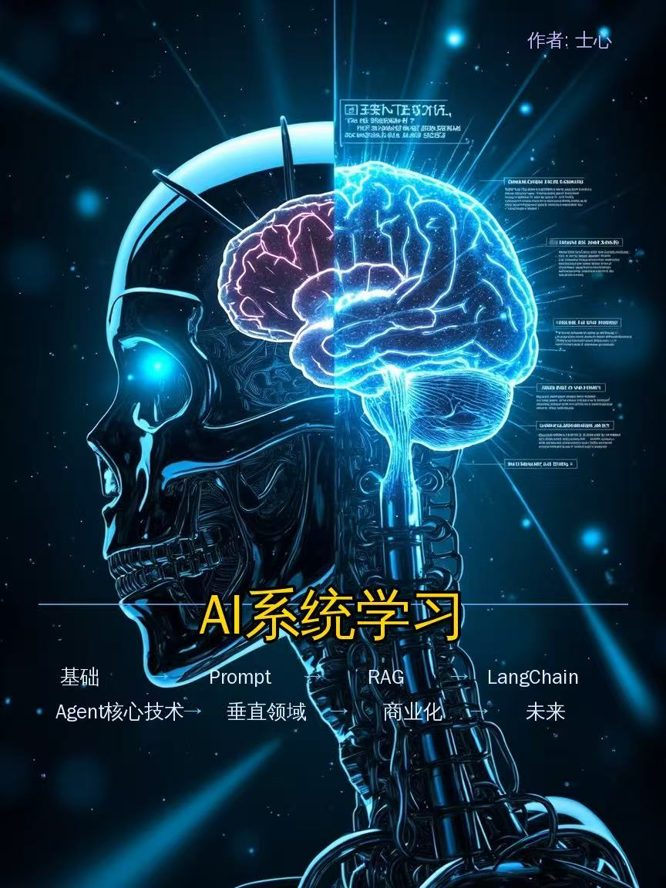

# AI Agent 学习课程：40 天从入门到实战

> 本课程面向零基础学习者，系统掌握 AI Agent 开发技能。使用国产大模型（GLM、DeepSeek、Qwen、Kimi）。

---

## 课程简介

**学完你能做什么：**
- ✅ 调用国产大模型 API 开发 Agent 应用
- ✅ 从零搭建 RAG 知识库问答系统
- ✅ 开发完整的多 Agent 协作系统
- ✅ 部署并运维生产级的 Agent 服务

---

## 课程结构概览

| 阶段 | 天数 | 课程数 | 核心内容 |
|------|------|--------|----------|
| 筑基阶段 | Day01-15 | 15 课 | 基础概念、函数调用、Agent 框架 |
| 核心阶段 | Day16-30 | 15 课 | Agent 核心能力、记忆、规划、协作 |
| 进阶阶段 | Day31-40 | 10 课 | 高级技术、微调、安全、生产化 |

📖 [完整课程大纲](OUTLINE.md)
📚 [扩展阅读](course/EXT_READING.md)

---

## 国产大模型 SDK

| 模型 | SDK | 适用场景 |
|------|-----|---------|
| 智谱 GLM | `zhipuai` | 通用对话、Function Calling |
| 通义千问 Qwen | `dashscope` / 阿里云百炼 | 通用对话、阿里云生态 |
| Kimi（月之暗面） | `openai` 兼容接口 | 长上下文、多模态 |
| DeepSeek | `openai` 兼容接口 | 高性价比推理 |
| 本地部署 | Ollama（Qwen/Llama） | 完全自主可控 |

---

## 技术栈汇总

### 国产大模型

| 模型 | 特点 | 使用场景 |
|------|------|----------|
| GLM-5.1 | 智谱，支持长上下文 | 通用对话、Function Calling |
| DeepSeek V4 | 深度求索，性价比高 | 代码生成、数学推理 |
| Qwen 3.6 | 阿里通义，支持多模态 | 多模态任务、阿里生态 |
| Kimi K2.6 | 月之暗面，长文本强 | 长文档分析、RAG |

### 国产技术栈

| 类别 | 工具 | 说明 |
|------|------|------|
| 向量数据库 | Milvus、Zilliz | 国产向量数据库 |
| Agent框架 | LangChain、国产框架 | Agent开发框架 |
| 部署平台 | 阿里云、腾讯云、火山引擎 | 国产云服务 |
| 数据平台 | DataWorks、ByteHouse | 国产数据平台 |

---

## 课程原则

1. **先概念后实践**：每个技术先讲原理，再给代码
2. **国产优先**：只使用国产大模型和技术栈
3. **自包含**：每课独立，不引用其他课程内容
4. **实战导向**：代码示例占主要篇幅
5. **只看技术**：哲学讨论放到扩展阅读

---

## 参考资源

### 核心参考课程

| 课程 | 说明 |
|------|------|
| [Microsoft ai-agents-for-beginners](https://github.com/microsoft/ai-agents-for-beginners) | 现代 LLM Agent 应用层参考（设计原则/FC/RAG/MCP/评估/可观测性） |
| [Microsoft AI-For-Beginners](https://github.com/microsoft/AI-For-Beginners) | AI 基础理论层参考（NLP 演进/BDI 架构/AI 伦理） |

### Agent 开发框架

| 框架 | 说明 |
|------|------|
| [LangGraph](https://langchain-ai.github.io/langgraph/) | 图结构状态机 Agent 框架 |
| [AutoGen](https://microsoft.github.io/autogen/) | 多 Agent 对话与协作框架 |
| [Semantic Kernel](https://learn.microsoft.com/semantic-kernel/) | 企业级 AI 应用开发框架 |
| [CrewAI](https://github.com/crewAI/crewAI) | 多 Agent 协作框架 |

### 评估与标准

| 标准 | 说明 |
|------|------|
| [OWASP LLM Top 10](https://owasp.org/www-project-llm-top-10/) | 大模型安全威胁最新参考 |
| [GAIA Benchmark](https://huggingface.co/gaia-benchmark) | 通用 AI 助手能力评估基准 |
| [SWE-bench](https://swebench.com) | 代码 Agent 能力评估（真实 GitHub Issue 修复） |
| [WebArena](https://webarena.dev/) | 网页导航 Agent 评估基准 |

### 可观测性与工具

| 工具 | 说明 |
|------|------|
| [OpenTelemetry](https://opentelemetry.io/) | 可观测性标准（追踪/指标/日志） |
| [Langfuse](https://langfuse.com/) | LLM 应用追踪与评估平台 |

---

**更新日期：2026 年 5 月**
